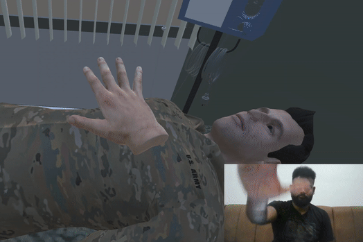
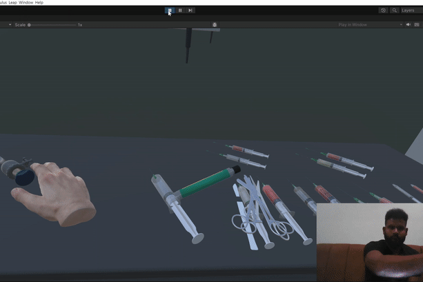
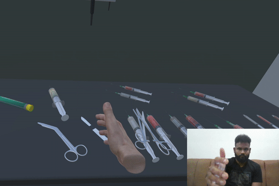
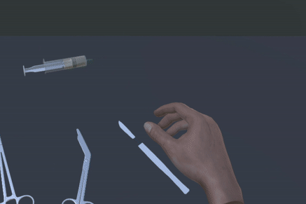
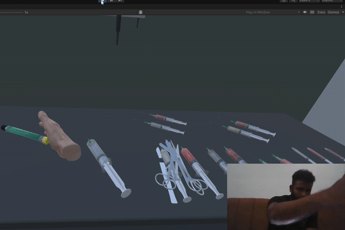
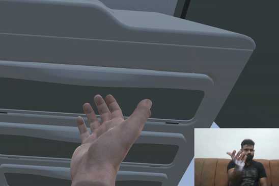
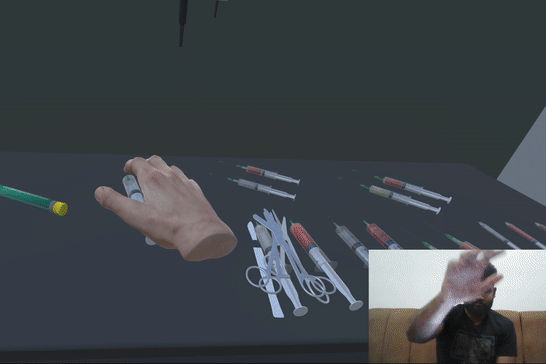
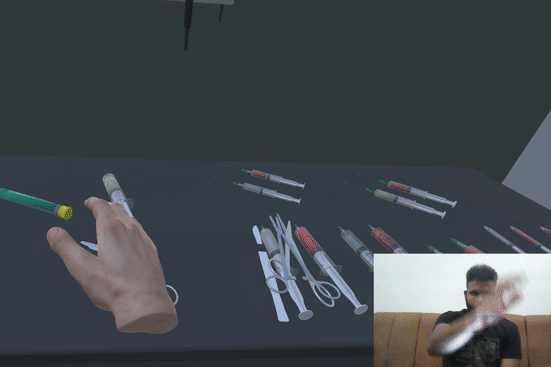
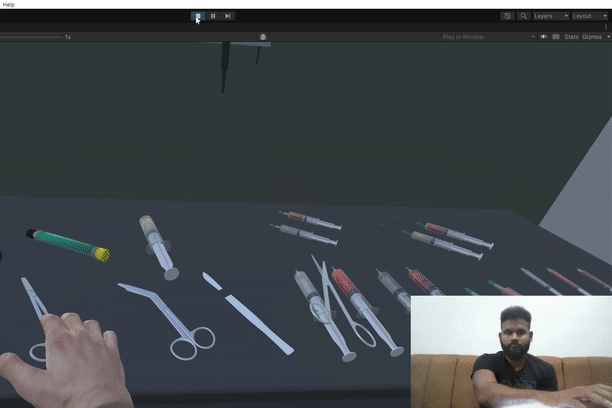
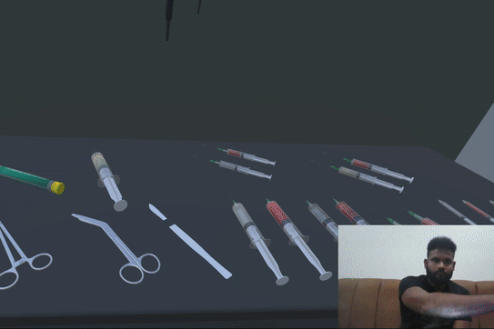

# Open Medical Gesture
From our efforts to produce more naturalistic interactions for combat medic training for the military, [USC-ICT MedVR team](https://ict.usc.edu/research/labs-groups/medical-virtual-reality/) has developed an open-source toolkit that enables direct hand-controlled responsive interactions that is device agnostic and can integrate with various devices that support hand-tracking. Natural approaches we have examined include the ability to manipulate virtual smart objects in a similar manner to how they are used in the real world.

## Hand Interaction capabilities
<table>

  <tr>
    <td>
      <p align="center">
        <b>Leap motion on HMD</b>
      </p>
    </td>
    <td>
      <p align="center">
        <b>Leap motion facing ceiling</b>
      </p>
    </td>
    <td>
      <p align="center">
        <b>Oculus Quest2</b>
      </p>
    </td>
  </tr>
  
  <tr>
    <td>
      <p align="center">
        
        <br/>
        <br/>
      </p>
    </td>
    <td>
      <p align="center">
        
        <br/>
        Auscultation
      </p>
    </td>
    <td>
      <p align="center">
        
        <br/>
        <br/>
      </p>
    </td>
  </tr>
  
  <tr>
    <td>
      <p align="center">
        
        <br/>
        <br/>
      </p>
    </td>
    <td>
      <p align="center">
        
        <br/>
        Trocar use
      </p>
    </td>
    <td>
      <p align="center">
        
        <br/>
        <br/>
      </p>
    </td>
  </tr>

  <tr>
    <td>
      <p align="center">
        
        <br/>
        <br/>
      </p>
    </td>
    <td>
      <p align="center">
        
        <br/>
        Bandage roll open/close
      </p>
    </td>
    <td>
      <p align="center">
        
        <br/>
        <br/>
      </p>
    </td>
  </tr>

  <tr>
    <td>
      <p align="center">
        
        <br/>
        <br/>
      </p>
    </td>
    <td>
      <p align="center">
        
        <br/>
        Scalpel use
      </p>
    </td>
    <td>
      <p align="center">
        
        <br/>
        <br/>
      </p>
    </td>
  </tr>

  <tr>
    <td>
      <p align="center">
        
        <br/>
        <br/>
      </p>
    </td>
    <td>
      <p align="center">
        
        <br/>
        Autoinjector actuate
      </p>
    </td>
     <td>
      <p align="center">
        
        <br/>
        <br/>
      </p>
    </td>
  </tr>

  <tr>
    <td>
      <p align="center">
        
        <br/>
        <br/>
      </p>
    </td>
    <td>
      <p align="center">
        
        <br/>
        Drawer push/pull
      </p>
    </td>
    <td>
      <p align="center">
        
        <br/>
        <br/>
      </p>
    </td>
  </tr>

  <tr>
    <td>
      <p align="center">
        
        <br/>
        <br/>
      </p>
    </td>
    <td>
      <p align="center">
        
        <br/>
        Syringe press/release
      </p>
    </td>
    <td>
      <p align="center">
        
        <br/>
        Syringe press/release (gif to be updated)
      </p>
    </td>
  </tr>

  <tr>
    <td>
      <p align="center">
        
        <br/>
        <br/>
      </p>
    </td>
    <td>
      <p align="center">
        
        <br/>
        Bandage Scissors open/close
      </p>
    </td>
    <td>
      <p align="center">
        
        <br/>
        Bandage Scissors open/close (gif to be updated)
      </p>
    </td>
  </tr>

  <tr>
    <td>
      <p align="center">
        
        <br/>
        <br/>
      </p>
    </td>
    <td>
      <p align="center">
        
        <br/>
        Needle Forceps open/close
      </p>
    </td>
    <td>
      <p align="center">
        
        <br/>
        Needle Forceps open/close (gif to be updated)
      </p>
    </td>
  </tr>

  <tr>
    <td>
      <p align="center">
        
        <br/>
        <br/>
      </p>
    </td>
    <td>
      <p align="center">
        
        <br/>
        Scissors open/close
      </p>
    </td>
    <td>
      <p align="center">
        
        <br/>
        Scissors open/close (gif to be updated)
      </p>
    </td>
  </tr>
  
</table>

## Integration
The entire updated documentation can be found in the [Documentation/OpenMG2.0 SDK+Code Setup Guide.pdf](https://github.com/chinmaychinara91/open-medical-gesture/blob/main/Documentation/OpenMG2.0%20SDK%2BCode%20Setup%20Guide.pdf) file in the repo.
Either clone this repo or use the [unitypackage](https://drive.google.com/drive/folders/1PoRrG6cwN4gqjirx7aCeYGcsiRBY12q-?usp=sharing) as per the document version above.

## Citation
If you use any data or any code released in this repository, please cite this [article](https://openaccess.cms-conferences.org/publications/book/978-1-958651-26-1/article/978-1-958651-26-1_0).
```bibtex
@inproceedings{brett_talbot_open_2022,
title = {Open Medical Gesture: An Open-Source Experiment in Naturalistic Physical Interactions for Mixed and Virtual Reality Simulations},
author = {Thomas Brett Talbot and Chinmay Chinara},
url = {https://openaccess.cms-conferences.org/publications/book/978-1-958651-26-1/article/978-1-958651-26-1_0},
doi = {10.54941/ahfe1002054},
year = {2022},
date = {2022-01-01},
urldate = {2022-09-13},
}
```
