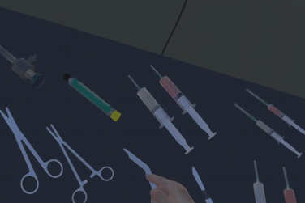
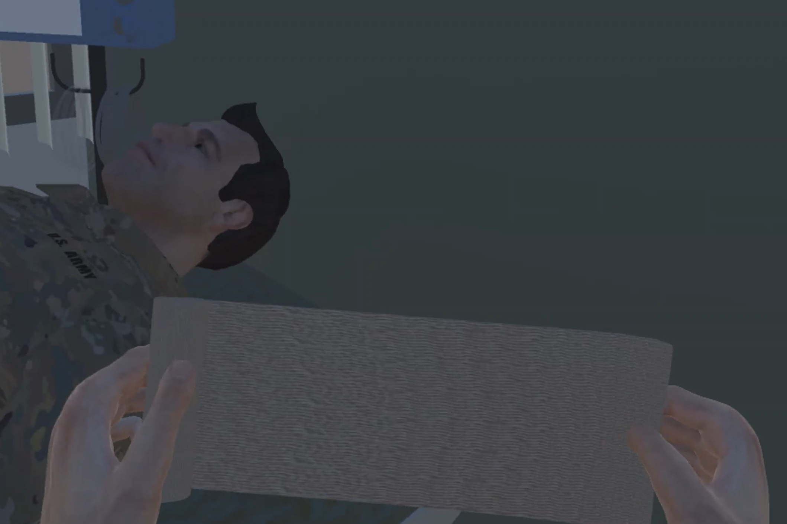

# openmg-2.0-metamersive
OpenMG 2.0 SDK for Metamersive.

## Hand Interactions
<table>
  <tr>
    <td>
      

        
         
        Auscultation
      

    </td>
    <td>
      

        
         
        Autoinjector actuate
      

    </td>
  </tr>
  
  <tr>
    <td>
      

        
         
        Bandage Scissors open/close
      

    </td>
    <td>
      

        
         
        Bandage Roll open/close
      

    </td>
  </tr>

  <tr>
    <td>
      

        
         
        Needle Forceps open/close
      

    </td>
    <td>
      

        
         
        Scalpel use
      

    </td>
  </tr>

  <tr>
    <td>
      

        
         
        Scissors open/close
      

    </td>
    <td>
      

        
         
        Syringe press/release
      

    </td>
  </tr>

  <tr>
    <td>
      

        
         
        Trocar use
      

    </td>
    <td>
      

        
         
        Drawer open/close
      

    </td>
  </tr>
</table>
