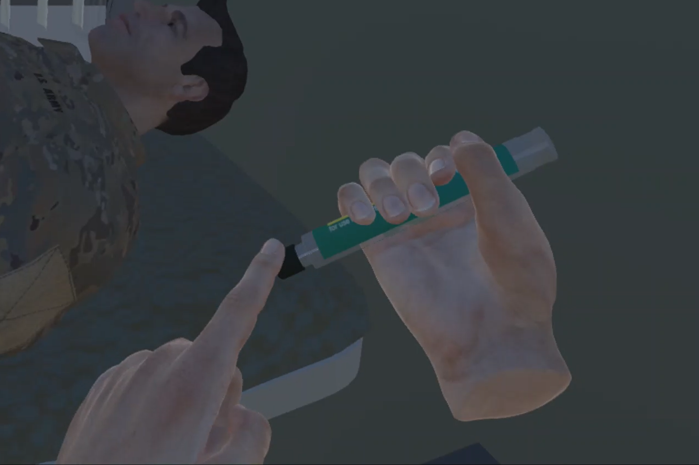
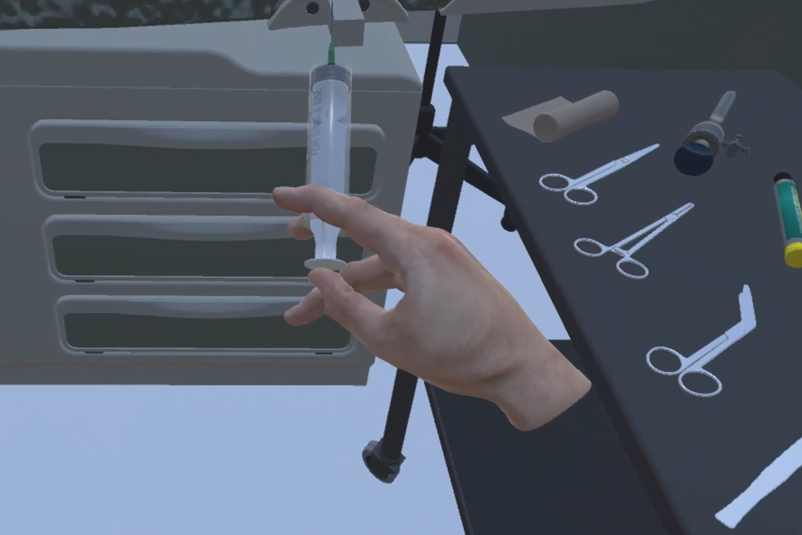

# openmg-2.0-metamersive
OpenMG 2.0 SDK for Metamersive.

&nbsp;&nbsp;&nbsp;&nbsp;

 
 
&nbsp;&nbsp;&nbsp;&nbsp;

 
 
&nbsp;&nbsp;&nbsp;&nbsp;

 
 
&nbsp;&nbsp;&nbsp;&nbsp;

 
 
&nbsp;&nbsp;&nbsp;&nbsp;

 
 
&nbsp;&nbsp;&nbsp;&nbsp;

 
 
&nbsp;&nbsp;&nbsp;&nbsp;

 
 
&nbsp;&nbsp;&nbsp;&nbsp;

 
 
&nbsp;&nbsp;&nbsp;&nbsp;

